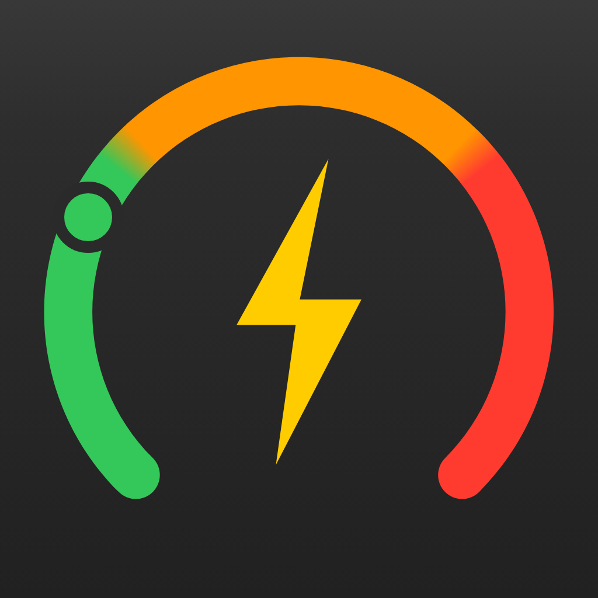

<h1 align="center">EPWatch</h1>

App displaying the current electricity price,  with widgets for Apple Watch, iPhone and iPad.

 

EPWatch is an open source app that allows you to see the current electricity price on your Apple Watch, iPhone and iPad. 
I created this app mainly for the Apple Watch, as I wanted such an app for myself and couldn't find one at the time. I added iPhone/iPad support because it was easy and I wanted try out the new iOS 16 lock screen widgets.

## Download

EPWatch is available on the [App Store](https://apps.apple.com/us/app/elpriset-widget/id1644399828?platform=appleWatch).

## Supported countries

The app uses the [Day-ahead Prices](https://transparency.entsoe.eu/transmission-domain/r2/dayAheadPrices/show) from the [ENTSO-E Transparency Platform](https://transparency.entsoe.eu/) and supports all countries/areas available in the API, which are:

-   Austria
-   Belgium
-   Bulgaria
-   Croatia
-   Czech Republic
-   Denmark
-   Estonia
-   Finland
-   France
-   Germany
-   Greece
-   Hungary
-   Ireland
-   Italy
-   Latvia
-   Lithuania
-   Luxembourg
-   Netherlands
-   Norway
-   Poland
-   Portugal
-   Romania
-   Serbia
-   Slovakia
-   Slovenia
-   Spain
-   Sweden
-   Switzerland
-   Ukraine

Some countries (available in the API) don't seem to have data, which currently are disabled in the app:

-   Albania
-   Bosnia and Herzegovina
-   Cyprus
-   Georgia
-   Kosovo
-   Malta
-   Moldova
-   Montenegro
-   North Macedonia
-   Turkey
-   United Kingdom

## Build

-   Obtain an API token from https://transparency.entsoe.eu/ (you need to create an account, but it's free).
-   Hit Build & Run

## Resources

-   I found [this reddit answer](https://www.reddit.com/r/sweden/comments/r50v12/comment/ik9kif9/) very helpful when I got started. I still don't understand the entsoe documentation on how to construct the `in_Domain`/`out_Domain` values of the query (If there's a better way than manually copying the codes!?) :)
-   [Transparency Platform RESTful API - user guide](https://transparency.entsoe.eu/content/static_content/Static%20content/web%20api/Guide.html)

## Issues

Feel free to create an issue for any bugs, feature requests or questions.
